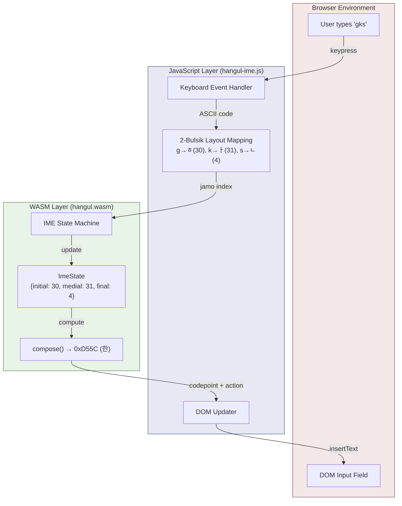
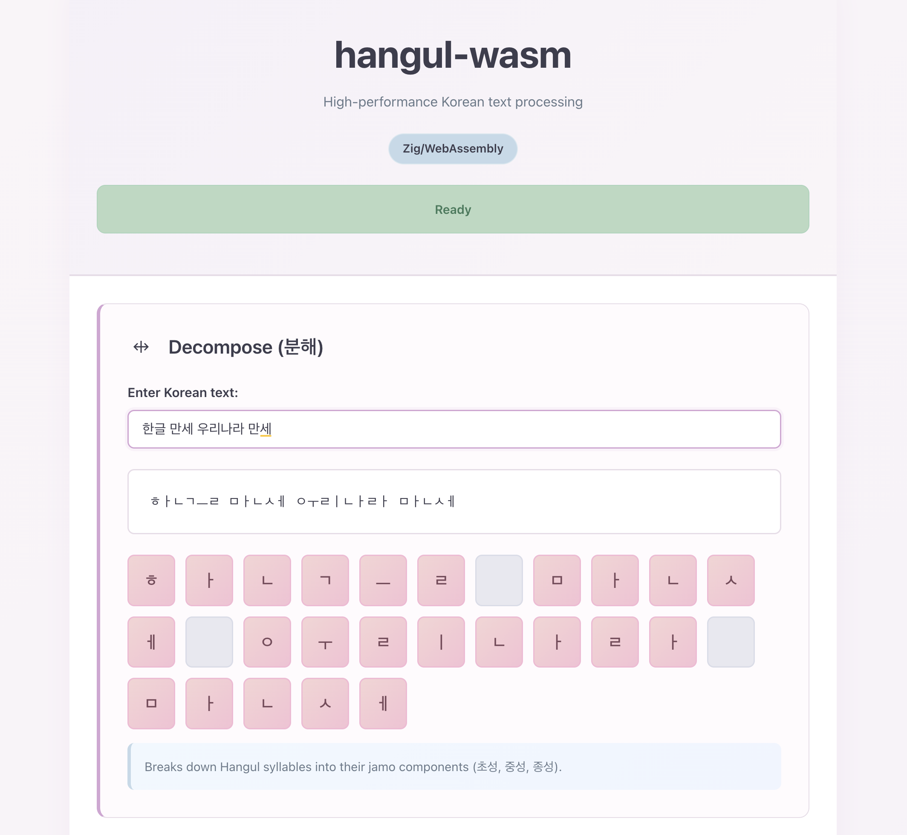

# hangul-wasm: Zig/WASM Port of hangul.js

A high-performance WebAssembly library for Korean text processing, implemented in Zig. Decomposes Hangul syllables into jamo components and composes them back with O(1) operations.

**Source Repository**: https://github.com/pastel-sketchbook/hangul-wasm


*Visual keyboard showing "한글을 입력할 수 있어요" being typed with 2-Bulsik layout*

## About

This is a Zig-based implementation of Korean text processing functionality, compiled to WebAssembly for optimal performance. The original JavaScript library by kwseok provides utilities for decomposing and composing Korean syllables. This port brings those capabilities to WASM while maintaining API compatibility.

## Architecture

This library uses a **hybrid WASM + JavaScript architecture**:

### Core Logic (WASM - `hangul.wasm`)
**What it does:**
- **Korean text algorithms**: Decomposition, composition, syllable validation
- **IME state machine**: Tracks jamo composition state and handles syllable splitting
- **Memory management**: Efficient allocation for buffer operations

**Why WASM:**
- **Performance**: O(1) algorithmic operations compiled to native code
- **Size**: ~7KB optimized binary (vs ~50KB JavaScript equivalent)
- **Type safety**: Zig's compile-time guarantees prevent runtime errors

### UI Integration Layer (JavaScript - `hangul-ime.js`)
**What it does:**
- **Keyboard event handling**: Captures keypresses, maps keys to jamo indices
- **DOM manipulation**: Inserts/replaces text in input fields
- **Browser API integration**: Selection ranges, focus management, event coordination
- **Layout mapping**: Converts QWERTY keys to 2-Bulsik Korean layout

**Why JavaScript:**
- **DOM access**: WASM cannot directly access browser APIs or modify HTML elements
- **Event system**: Browser events (keypress, keydown, focus) are JavaScript-only
- **Async coordination**: Managing multiple input fields and state requires JS event loop
- **Debugging**: Runtime inspection and console logging for developer experience

### Division of Responsibility



```
User types "g" on keyboard
         ↓
[JavaScript] Captures keypress event → Maps 'g' to jamo index 30 (ㅎ)
         ↓
[WASM] Processes jamo index → Returns composed syllable or action code
         ↓
[JavaScript] Receives result → Updates DOM with Korean character
```

**Both are required:** WASM provides the algorithmic core, JavaScript provides the browser integration. This separation keeps the WASM module small and reusable across different UI frameworks.

## Features

### Core Functions

**WASM-exported functions (use `wasm_` prefix in JavaScript):**

Core Functions:
- **`wasm_isHangulSyllable(c: u32) -> bool`**: Check if a character is a valid Hangul syllable (가-힣, U+AC00 to U+D7A3)
- **`wasm_decompose(syllable: u32, output_ptr: u32) -> bool`**: Decompose syllable into jamo; writes 3 u32 values (initial, medial, final) to WASM memory at offset. WARNING: Caller must allocate at least 12 bytes via wasm_alloc.
- **`wasm_decompose_safe(syllable: u32, output_ptr: u32, output_size: u32) -> bool`**: Safe variant with buffer size validation. Returns false if buffer too small (requires output_size >= 3).
- **`wasm_compose(initial: u32, medial: u32, final: u32) -> u32`**: Compose jamo into syllable code point (returns 0 if invalid)
- **`wasm_hasFinal(syllable: u32) -> bool`**: Check if a syllable has a final consonant (받침)
- **`wasm_getInitial(syllable: u32) -> u32`**: Extract initial consonant (초성) from a syllable
- **`wasm_getMedial(syllable: u32) -> u32`**: Extract medial vowel (중성) from a syllable
- **`wasm_getFinal(syllable: u32) -> u32`**: Extract final consonant (종성) from a syllable
- **`wasm_decomposeString(input_ptr: u32, input_len: u32, output_ptr: u32) -> u32`**: Decompose UTF-8 string into jamo code points; returns count of output code points

**Memory management:**
- **`wasm_alloc(size: u32) -> u32`**: Allocate WASM memory; returns byte offset (0 on failure)
- **`wasm_free(ptr: u32, size: u32) -> void`**: Free memory; auto-resets allocator when all allocations freed
- **`wasm_alloc_reset() -> void`**: Reset allocator completely (invalidates all pointers)
- **`wasm_alloc_used() -> u32`**: Get bytes currently allocated (for debugging)
- **`wasm_alloc_count_active() -> u32`**: Get number of active allocations (for debugging)

**IME (Input Method Editor) Functions:**
- **`wasm_ime_create() -> u32`**: Create IME instance; returns handle (0 on failure)
- **`wasm_ime_destroy(handle: u32) -> void`**: Destroy IME instance and free resources
- **`wasm_ime_reset(handle: u32) -> void`**: Reset IME composition state
- **`wasm_ime_processKey(handle: u32, jamo_index: i8, result_ptr: u32) -> bool`**: Process keystroke (2-Bulsik); writes action/codepoints to result buffer (12 bytes)
- **`wasm_ime_processKey3(handle: u32, ascii: u8, result_ptr: u32) -> bool`**: Process keystroke (3-Bulsik); writes action/codepoints to result buffer (16 bytes)
- **`wasm_ime_backspace(handle: u32) -> u32`**: Process backspace; returns updated codepoint (0 if empty)
- **`wasm_ime_commit(handle: u32) -> u32`**: Commit current composition and reset state; returns finalized codepoint
- **`wasm_ime_getState(handle: u32, output_ptr: u32) -> void`**: Get current state for debugging (6 bytes: initial, initial_flag, medial, medial_flag, final, final_flag)

### IME Features

- **2-Bulsik (Dubeolsik) Keyboard Layout**: Standard Korean keyboard layout (default)
- **3-Bulsik (Sebeolsik) Keyboard Layout**: Traditional three-set layout with separate keys for initial/final consonants
- **Real-time Composition**: Convert keystrokes into Hangul syllables as you type
- **Double Jamo Support**: Automatic handling of ㄲ, ㄸ, ㅃ, ㅆ, ㅉ (consonants) and ㅘ, ㅝ, ㅢ, etc. (vowels)
- **Syllable Splitting**: Intelligently splits syllables when needed (e.g., typing 한 + ㅏ → 하 + ㄴㅏ) — 2-Bulsik only
- **Backspace Decomposition**: Step-by-step decomposition (한 → 하 → ㅎ → ∅)
- **Blur Handling**: Automatically commits composition when input loses focus
- **Stateful Processing**: Maintains composition buffer for complex input sequences

### Technical Highlights

- **Full Unicode Hangul Support**: Handles all 11,172 valid Hangul syllables (U+AC00 to U+D7A3)
- **UTF-8 Encoding**: Proper UTF-8 decoding for multi-byte character sequences
- **Compatibility Jamo**: Uses Unicode Hangul Compatibility Jamo (U+3131–U+318E) for decomposed output
- **Zero Dependencies**: No external libraries required
- **WASM Optimized**: Compiled with Zig's release-small optimization for minimal binary size
- **Memory Safe**: All operations are bounds-checked and panic-free in production paths

## Architecture

### Data Structures

```
JamoDecomp:
  - initial: u32  (compatibility jamo character code)
  - medial: u32   (compatibility jamo character code)
  - final: u32    (compatibility jamo character code, 0 if no final)
```

### Unicode Constants

- **Hangul Syllable Range**: U+AC00 (가) to U+D7A3 (힣)
- **Initial Jamo (초성)**: 19 forms (U+1100 onwards)
- **Medial Jamo (중성)**: 21 forms (U+1161 onwards)
- **Final Jamo (종성)**: 28 forms including 0 (no final) (U+11A8 onwards)

### Composition Formula

A Hangul syllable is composed using:
```
syllable = HANGUL_SYLLABLE_BASE + (initial_idx × 21 × 28) + (medial_idx × 28) + final_idx
```

This formula allows O(1) decomposition and composition operations.

## Building

### Requirements

- **Zig**: 0.15 or later

### Quick Build

Use the included Taskfile:

```bash
task build:wasm       # Build hangul.wasm (ReleaseSmall - optimized for size)
task build:wasm:fast  # Build with ReleaseFast (optimized for speed)
task build:wasm:debug # Build with Debug info
```

### Manual Compilation

```bash
# Optimized for size (recommended)
zig build-obj hangul.zig -target wasm32-freestanding -O ReleaseSmall

# Optimized for speed
zig build-obj hangul.zig -target wasm32-freestanding -O ReleaseFast

# With debug information
zig build-obj hangul.zig -target wasm32-freestanding -O Debug
```

### Build Profiles

- **ReleaseSmall** (~7 KB): Optimized binary size, ideal for web distribution
- **ReleaseFast** (97 KB): Optimized runtime performance
- **Debug**: Full debug information for development

## Testing

Run tests using Taskfile or directly:

```bash
task test             # Run Zig unit tests (58 tests)
task test:verbose     # Run with verbose output
task test:e2e         # Run Playwright end-to-end tests (13 tests)
task check:all        # Format check + lint + test + build
```

Or run directly:

```bash
zig test hangul.zig                    # Unit tests
bunx playwright test                   # E2E tests (requires demo server)
```

### Test Suite

The implementation includes **71 tests** (58 unit + 13 e2e):

**Unit Tests (Zig - 58 tests):**

*Core decomposition/composition:*
- Validates correct decomposition of boundary and mid-range syllables
- Tests 가 (U+AC00, first syllable) with no final consonant
- Tests 한 (U+D55C, mid-range) with final consonant
- Verifies compatibility jamo output
- Exhaustive roundtrip testing of all 11,172 Hangul syllables

*IME (Input Method Editor):*
- 2-Bulsik keyboard layout mapping
- Double jamo detection (initial, medial, final consonants)
- Syllable splitting and composition
- Double final consonant splitting (e.g., ㄺ → ㄹ + ㄱ)
- Backspace decomposition

*UTF-8 and validation:*
- UTF-8 decoding for Korean text
- Invalid jamo combination rejection
- Buffer validation for WASM exports

**End-to-End Tests (Playwright - 13 tests):**

*2-Bulsik IME:*
- Typing 한글 and 안녕
- Space key finalization
- Backspace decomposition
- Double consonants (ㅆ)
- Final consonant splitting

*3-Bulsik IME:*
- Tab switching between layouts
- Typing 한글 in 3-Bulsik mode

*Blur handling:*
- Composition commits on focus loss

*Tools:*
- Decompose and compose functions

### All Tests Passing

```bash
# Unit tests
57 passed; 1 skipped; 0 failed.

# E2E tests
13 passed
```

The skipped unit test (`wasm_decompose_safe buffer validation`) only runs on WASM targets.

## Usage

### JavaScript / Browser

```javascript
// Load the WASM module
async function initializeWasm() {
  try {
    const response = await fetch('hangul.wasm');
    const buffer = await response.arrayBuffer();
    const { instance } = await WebAssembly.instantiate(buffer);
    window.wasmModule = instance.exports;
  } catch (error) {
    console.error('WASM initialization error:', error);
    // Falls back to JavaScript implementation
  }
}

initializeWasm();

// Check if character is Hangul (uses WASM when available)
const code = 0xD55C; // '한'
if (window.wasmModule && window.wasmModule.wasm_isHangulSyllable(code)) {
  console.log('Character is Hangul');
}

// Decompose syllable into jamo (allocate memory via wasm_alloc)
const bufPtr = window.wasmModule.wasm_alloc(12); // 3 × u32 = 12 bytes
if (bufPtr !== 0 && window.wasmModule.wasm_decompose(0xD55C, bufPtr)) {
  // Read from WASM linear memory
  const memory = new Uint32Array(window.wasmModule.memory.buffer);
  const offset = bufPtr / 4; // Convert byte offset to u32 offset
  const initial = String.fromCharCode(memory[offset]);     // ㅎ (0x314E)
  const medial = String.fromCharCode(memory[offset + 1]);  // ㅏ (0x314F)
  const final = memory[offset + 2] !== 0 ? String.fromCharCode(memory[offset + 2]) : ""; // ㄴ (0x3134)
  console.log(`Jamo: ${initial}${medial}${final}`); // ㅎㅏㄴ
  window.wasmModule.wasm_free(bufPtr, 12);
}

// Compose jamo into syllable
const composed = window.wasmModule.wasm_compose(0x3131, 0x314F, 0); // ㄱ + ㅏ
console.log(String.fromCharCode(composed)); // '가'

// Check for final consonant (받침)
const hasFinal = window.wasmModule.wasm_hasFinal(0xD55C); // '한'
console.log(hasFinal); // true
```

### Bun

```javascript
// Load WASM module
const wasmBuffer = await Bun.file('hangul.wasm').arrayBuffer();
const { instance } = await WebAssembly.instantiate(wasmBuffer);
const hangul = instance.exports;

// Use the same API as browser
const isHangul = hangul.wasm_isHangulSyllable(0xD55C);
const bufPtr = hangul.wasm_alloc(12);
if (bufPtr !== 0 && hangul.wasm_decompose(0xD55C, bufPtr)) {
  const memory = new Uint32Array(hangul.memory.buffer);
  const offset = bufPtr / 4;
  console.log('Initial:', String.fromCharCode(memory[offset]));
  console.log('Medial:', String.fromCharCode(memory[offset + 1]));
  console.log('Final:', String.fromCharCode(memory[offset + 2]));
  hangul.wasm_free(bufPtr, 12);
}
```

### IME (Input Method Editor) Usage

```javascript
import { HangulIme, setupIme } from './hangul-ime.js';

// Load WASM module with IME support
async function initializeIme() {
  const response = await fetch('hangul.wasm');
  const buffer = await response.arrayBuffer();
  
  const memory = new WebAssembly.Memory({ initial: 256, maximum: 512 });
  const imports = { 
    env: { 
      __linear_memory: memory,
      __stack_pointer: new WebAssembly.Global({ value: 'i32', mutable: true }, 0),
      __indirect_function_table: new WebAssembly.Table({ initial: 128, element: 'anyfunc' })
    } 
  };
  
  const wasmModule = await WebAssembly.instantiate(buffer, imports);
  
  // Method 1: Automatic setup for all input/textarea elements
  const ime = setupIme(wasmModule);
  ime.enable();
  
  // Method 2: Manual setup for specific fields
  const ime2 = new HangulIme(wasmModule);
  
  document.addEventListener('keypress', (e) => {
    if (e.target.matches('#myKoreanInput')) {
      if (ime2.handleKeyPress(e, e.target)) {
        e.preventDefault();
      }
    }
  });
  
  document.addEventListener('keydown', (e) => {
    if (e.target.matches('#myKoreanInput') && e.key === 'Backspace') {
      if (ime2.handleBackspace(e.target)) {
        e.preventDefault();
      }
    }
    
    // Toggle IME with Shift+Space
    if (e.shiftKey && e.code === 'Space') {
      e.preventDefault();
      ime2.isEnabled() ? ime2.disable() : ime2.enable();
    }
  });
}

// Example keyboard mappings (2-Bulsik layout):
// r → ㄱ, rr → ㄲ
// k → ㅏ, h → ㅗ, hk → ㅘ (auto-combination)
// Type "gksrmf" → 한글
// Type "dkssud" → 안녕

// Switching to 3-Bulsik layout:
ime2.setLayoutMode('3bulsik');
// In 3-Bulsik: separate keys for initial/final consonants
// Type with direct jamo mapping (no syllable splitting)

// Backspace behavior:
// 한 (backspace) → 하 (backspace) → ㅎ (backspace) → (empty)

// Blur handling:
// When input loses focus, any in-progress composition is committed automatically
```

### Debug Mode

Enable debug logging to see keypress events and IME state changes in the browser console:

**Via UI:** Click the "Debug: OFF/ON" button in the IME section

**Via Keyboard:** Press Ctrl+Shift+D to toggle debug mode

**Via Taskfile:**
```bash
task debug:enable      # Enable debug logging in hangul-ime.js
task debug:disable     # Disable debug logging in hangul-ime.js
task run:demo:debug    # Run demo with debug enabled (auto-disables after)
```

Debug logs are prefixed with `[HangulIme]` for easy console filtering. Example output:
```
[HangulIme] Key pressed: g (ㅎ) - initial consonant (index 0)
[HangulIme] WASM result: action=REPLACE, current=ㅎ (0x314E)
[HangulIme] Key pressed: k (ㅏ) - medial vowel (index 0)
[HangulIme] WASM result: action=REPLACE, current=하 (0xD558)
```

## Interactive Demo

An HTML demo (`index.html`) is included with:

- **Decomposition Viewer**: Real-time breakdown of Korean characters
- **Composition Tool**: Combine jamo to create syllables
- **Property Checker**: Inspect individual character properties
- **String Processor**: Decompose entire Korean text
- **한글 IME**: Type Korean using standard QWERTY keyboard
  - 2-Bulsik (두벌식) layout — standard, toggle with Shift+Space
  - 3-Bulsik (세벌식) layout — click tab button to switch



Run the demo locally:
```bash
task run:demo         # Build WASM + server, serve demo on localhost:8120
task run:demo:browse  # Same as above, also opens browser automatically
```

Generate the keyboard demo GIF:
```bash
task generate:gif     # Record visual keyboard typing "한글을 입력할 수 있어요"
```
**Prerequisites for GIF generation:** ffmpeg, Playwright (`bunx playwright install`)

The demo server is a lightweight Zig-based HTTP server (~352KB) built on [http.zig](https://github.com/karlseguin/http.zig). It serves only whitelisted files for security.

The demo includes fallback JavaScript implementation for development. When `hangul.wasm` is available, all decomposition/composition operations automatically use the optimized Zig/WASM module via:
- `wasm_isHangulSyllable()` for character validation
- `wasm_decompose()` with typed array output buffers
- `wasm_compose()` for jamo composition
- `wasm_hasFinal()` for final consonant checks

JavaScript fallback is used if WASM fails to load.

## Implementation Details

### UTF-8 Decoding

The library includes a custom UTF-8 decoder (`decodeUtf8Char`) to handle:

- 1-byte sequences (ASCII: 0x00–0x7F)
- 2-byte sequences (0xC0–0xDF)
- 3-byte sequences (0xE0–0xEF) — Hangul is encoded here
- 4-byte sequences (0xF0–0xFF)

Each decoded character is checked against the Hangul syllable range and processed accordingly.

### Memory Management

#### Safe Allocation Patterns

**For simple decomposition (recommended):**
```javascript
// Allocate memory via wasm_alloc
const bufPtr = hangul.wasm_alloc(12); // 3 × u32 = 12 bytes
if (bufPtr !== 0 && hangul.wasm_decompose(0xD55C, bufPtr)) {
  // Read from WASM linear memory
  const memory = new Uint32Array(hangul.memory.buffer);
  const offset = bufPtr / 4; // Convert byte offset to u32 offset
  console.log('Initial:', String.fromCharCode(memory[offset]));
  console.log('Medial:', String.fromCharCode(memory[offset + 1]));
  console.log('Final:', String.fromCharCode(memory[offset + 2]));
  hangul.wasm_free(bufPtr, 12);
}
```

**For bulk string processing:**
```javascript
// Allocate buffer for large string decomposition
const input = '한글'.repeat(1000); // Large Korean text
const maxOutput = input.length * 3; // Worst case: each char → 3 jamo
const outputSize = maxOutput * 4; // Each u32 = 4 bytes
const outPtr = hangul.wasm_alloc(outputSize);

if (outPtr === 0) {
  console.error('WASM allocation failed');
  return;
}

const memory = new Uint32Array(hangul.memory.buffer);
const outArray = memory.subarray(outPtr / 4, (outPtr / 4) + maxOutput);

// ... use outArray for string processing ...

// Always deallocate
hangul.wasm_free(outPtr, outputSize);
```

#### Allocation Guarantees

- **wasm_alloc(size)**: Returns byte offset into WASM linear memory, or 0 on failure
  - Check return value: `if (ptr === 0) { handle error }`
  - Size in bytes (not elements)
  - Uses 16KB bump allocator with auto-reset capability

- **wasm_free(ptr, size)**: Decrements allocation count; auto-resets when all freed
  - Tracks active allocation count
  - When count reaches 0, allocator resets automatically
  - Safe for bounded session usage (e.g., per-page-load)

- **wasm_alloc_reset()**: Force-reset allocator (invalidates all pointers)
  - Use for explicit cleanup (e.g., on page unload)

- **Output Buffer Sizing**:
  - `wasm_decompose`: Allocate exactly 12 bytes (3 × u32)
  - `wasm_decomposeString`: Caller responsible for buffer size
    - Input: UTF-8 bytes (1-4 bytes per character)
    - Output: One code point per Hangul jamo + non-Hangul chars
    - Worst case: All Hangul with finals (3 jamo per char) = input.length * 3 code points * 4 bytes

The WASM module uses a 16KB bump allocator with auto-reset capability for memory management. When all allocations are freed, the allocator automatically resets for reuse.

## Performance Characteristics

| Operation | Complexity | Notes |
|-----------|-----------|-------|
| `isHangulSyllable` | O(1) | Simple range check |
| `decompose` | O(1) | Arithmetic decomposition |
| `compose` | O(1) | Comptime-generated reverse lookup tables |
| `decomposeString` | O(n) | Linear scan with UTF-8 decoding |

### Benchmark Results

Run `task benchmark` to compare WASM vs pure JavaScript performance:

```
Single Operations (100K iterations, per-keystroke IME use case):
  isHangulSyllable:  WASM 1.9x faster  (27M ops/sec vs 14M ops/sec)
  decompose:         WASM 1.7x faster  (34M ops/sec vs 21M ops/sec)
  compose:           WASM 1.8x faster  (31M ops/sec vs 17M ops/sec)

Bulk Operations (11,172 syllables):
  JavaScript can be faster due to WASM function call overhead (0.67x)
```

**Recommendation:** Use WASM for interactive IME (single operations per keystroke). For batch processing of large texts, benchmark both approaches for your specific use case.

## Compatibility

### Browser Support

- All modern browsers with WebAssembly support (Chrome 57+, Firefox 52+, Safari 14.1+, Edge 15+)

### Bun Support

- Bun 1.0+ (native WebAssembly support)

## Differences from Original hangul.js

This port focuses on the core decomposition/composition functionality:

**Implemented:**
- [x] `isHangulSyllable` (similar to `isComplete`)
- [x] `decompose` (similar to `disassemble`)
- [x] `compose` (similar to `assemble`)
- [x] `hasFinal` / `getInitial` / `getMedial` / `getFinal`
- [x] String processing with UTF-8 support
- [x] Keyboard input method handling (2-Bulsik and 3-Bulsik layouts)
- [x] Jamo classification utilities (`isJamo`, `isVowel`, `isConsonant`)

**Not Implemented (Advanced Features):**
- [ ] `search` / `Searcher` (advanced pattern matching)
- [ ] `rangeSearch` (highlight/range detection)

These can be added if needed; the core algorithmic foundation is in place.

## Security Considerations

- All operations are performed on Unicode code points, not strings
- No external input parsing (caller is responsible for UTF-8 decoding)
- Bounds checking on jamo lookup tables
- No panics in production code paths
- Deterministic behavior (no randomness or external state)

## Documentation

### Rationale & Design

- [**0001: Hangul Decomposition Algorithm**](./docs/rationale/0001_hangul_decomposition_algorithm.md) — Mathematical foundations of O(1) composition/decomposition, UTF-8 handling, boundary conditions, and algorithmic correctness guarantees.
- [**0002: ohi.js IME Port Strategy**](./docs/rationale/0002_ohi_js_ime_port_strategy.md) — Design analysis for porting ohi.js IME, including 2-Bulsik and 3-Bulsik keyboard layouts.
- [**0003: http.zig Static Server**](./docs/rationale/0003_http_zig_static_server.md) — Rationale for replacing Python server with native Zig/http.zig server.

### Development Guidelines

See [AGENTS.md](./AGENTS.md) for project principles, TDD workflow, commit conventions, and release procedures.

## Development

This project follows the principles outlined in [AGENTS.md](./AGENTS.md):

### TDD Workflow

1. Write failing tests first (Red)
2. Implement minimal code to pass tests (Green)
3. Refactor and tidy (Refactor)

Use `task pre:commit` before committing to ensure formatting and tests pass.

### Code Style

- Follows Zig conventions
- Const-first, explicit error handling with `?` operator
- Comprehensive Unicode comments with U+XXXX references
- Algorithm comments explain decomposition/composition mathematics

### Available Tasks

```bash
task fmt              # Format code
task fmt:check        # Check formatting (CI-friendly)
task test             # Run Zig unit test suite
task test:verbose     # Verbose test output
task test:e2e         # Run Playwright e2e tests
task benchmark        # Run WASM vs JavaScript benchmarks
task build:wasm       # Build optimized WASM
task build:server     # Build http.zig static file server
task check:all        # Full quality check
task pre:commit       # Pre-commit checks (fmt + test)
task generate:gif     # Generate keyboard demo GIF (requires ffmpeg, Playwright)
task run:demo         # Build WASM + server, serve interactive demo
task run:demo:browse  # Build, serve, and open in browser
task clean            # Remove build artifacts
```

## Credits

This project is a Zig/WebAssembly port of [**hangul.js**](https://github.com/kwseok/hangul.js) by [kwseok](https://github.com/kwseok). The original library provided the algorithmic foundation and API design that informed this implementation.

**ohi.js** ([Ho-Seok Ee](https://gist.github.com/channy/5943520)) - This project contains a direct port of ohi.js, which provides the Korean IME (Input Method Editor) implementation. More than half of this codebase consists of direct ports and derivative works from ohi.js. The original ohi.js provides browser-based Korean input method functionality for Dubeolsik (2-bulsik) and Sebeolsik (3-bulsik) keyboard layouts.

## License

**GNU General Public License v2.0 or later (GPL-2.0-or-later)**

This project is licensed under the GNU General Public License v2 or later, as required by its dependency on and derivation from ohi.js.

**Original Work:**
- **ohi.js** by Ho-Seok Ee <hsee@korea.ac.kr>
- Copyright (C) Ho-Seok Ee
- Licensed under GPL v2 or later

**This Project (hangul-wasm):**
- Copyright (C) 2026 Pastel Sketchbook Project
- Licensed under GPL v2 or later

Since more than half of this codebase consists of direct ports and derivative works from ohi.js (which is GPL v2 licensed), this entire project must be distributed under the GNU General Public License v2 or later.

See the [LICENSE](./LICENSE) file for the complete license text.

## References

- [Original hangul.js Repository](https://github.com/kwseok/hangul.js)
- [ohi.js - Korean IME](https://gist.github.com/channy/5943520) by Ho-Seok Ee
- [Unicode Hangul Block Specification](https://www.unicode.org/charts/PDF/UAC00.pdf)
- [Zig Language Documentation](https://ziglang.org/documentation/master/)
- [WebAssembly Specification](https://webassembly.org/)

## Related Projects

- [Hangul.js (E-)](https://github.com/e-/Hangul.js): Feature-rich JavaScript implementation
